<div align="center">

<!-- HERO -->


<br />

# **orchestrator-runtime**

### *Complete AI engineering operations. Discovery → Tickets → Verification → Execution → Governance → Observability.*

**Self-improving · Multi-agent · Kleppmann fencing · RLS-ready · ~70% stall reduction**

<br />

[](LICENSE)
[](.github/workflows/ci.yml)
[](tests/)
[](pyproject.toml)
[](src/orchestrator_runtime/templates/migrations/postgres)
[](src/orchestrator_runtime/templates/migrations/sqlite)
[](pyproject.toml)

<br />

```bash
pip install orchestrator-runtime
orchestrator-setup install-cli    # installs /setup-project globally

cd /path/to/your/project
/setup-project                    # 5 questions, 30 seconds, done
```

</div>

---

## What this is

`orchestrator-runtime` is **not just an anti-stall pattern**. It's a **complete engineering operations platform** for AI coding agents — the missing infrastructure that turns an LLM into a disciplined engineering organization.

The runtime gives you 13 capabilities that together run the **entire codebase evolution loop**:

| # | Capability | What it does |
|---|---|---|
| 1 | **Discovery** | Scans your code for opportunities that haven't become tickets yet |
| 2 | **Ticketing** | Formalizes opportunities with AC, evidence, expert reviews, dependencies |
| 3 | **Verification** | 3-6 perspective adversarial voting per ticket (correctness, per-tenant, failure modes, security, performance, reversibility) |
| 4 | **Burn Queue** | Small-scope claim → execute → verify → done, anti-stall throughout |
| 5 | **Architecture Audit** | Reconciles intended (ADRs) vs actual (code) — drift detection |
| 6 | **ADR Audit** | Verifies every ADR claim is observed in the codebase |
| 7 | **Vision Reconciliation** | Compares world model vs project state — closes the silent rot gap |
| 8 | **Approval Gate** | Human-in-the-loop approvals for high-risk changes (Postgres-backed fencing) |
| 9 | **Fitness Gates** | 8 atomic CI gates, one per non-negotiable invariant |
| 10 | **Resource Scheduler** | macOS-aware CPU/RAM probe + concurrency cap |
| 11 | **Status & Timer** | Operational dashboard + ETA projection |
| 12 | **Expert Council** | Routes opportunities to specialists (security, regulatory, ops, etc.) |
| 13 | **Self-Improvement** | The orchestrator audits itself and emits `orch-self` tickets |

The platform **manages your entire codebase evolution** — not just one ticket at a time.

<br />



<br />

<sub>

[**▶ Full interactive theater (click, pause, speed control)**](docs/theater.html) · [**Architecture diagram ↓**](#architecture)

</sub>

---

## Why this exists

Every codebase that grows beyond a few thousand lines develops **silent rot**:

- Tickets get filed but never closed
- ADRs get written but no one verifies they're followed
- TODOs accumulate in code comments but never become work
- Drift between vision and implementation goes unnoticed for months
- AI agents stall at 600s watchdog with nothing shipped
- High-risk changes bypass review because the approval flow is too slow

`orchestrator-runtime` is the **infrastructure that prevents all of these**. It's the engineering-management layer that turns an AI agent from a code generator into a disciplined engineering organization that:

- **Discovers** its own work (Discovery)
- **Formalizes** the work with clear acceptance criteria (Ticketing)
- **Verifies** the work adversarially (Verification)
- **Executes** the work without stalling (Burn Queue)
- **Governs** itself (Architecture Audit, ADR Audit, Fitness Gates, Approval Gate)
- **Observes** its own state (Status, Scheduler, Timer)
- **Improves** itself (Self-Improvement loop)

The anti-stall pattern is **one capability** out of thirteen. The full system manages the entire evolution of a codebase.

<br />

## Architecture

The runtime is a **filesystem-as-database** orchestrator. Everything lives in `orchestrator/` after bootstrap. No external services required.

```
   ┌──────────────────────────────────────────────────────────────────────┐
   │                                                                      │
   │   orchestrator-runtime (the engine)                                │
   │   ════════════════════════════════════                                │
   │                                                                      │
   │   53+ scripts  ·  20+ slash commands  ·  13 capabilities             │
   │                                                                      │
   │   ┌────────────────────────────────────────────────────────────────┐ │
   │   │                   13 capabilities, wired                        │ │
   │   │                                                                │ │
   │   │  ┌──────────┐   ┌──────────┐   ┌──────────┐   ┌──────────┐     │ │
   │   │  │DISCOVERY │──▶│TICKETING │──▶│VERIFI-   │──▶│EXECUTION │     │ │
   │   │  │          │   │          │   │CATION    │   │          │     │ │
   │   │  │scan code │   │file TKT  │   │3-6 lens  │   │burn queue│     │ │
   │   │  │for oppor-│   │with AC + │   │adversar- │   │anti-stall│     │ │
   │   │  │tunities  │   │evidence  │   │ial voting│   │small     │     │ │
   │   │  └──────────┘   └──────────┘   └──────────┘   │scope     │     │ │
   │   │                                                └──────────┘     │ │
   │   │  ┌──────────┐   ┌──────────┐   ┌──────────┐   ┌──────────┐     │ │
   │   │  │ARCHITECT │   │ADR AUDIT │   │APPROVAL  │   │VISION    │     │ │
   │   │  │URE AUDIT │   │verify    │   │GATE      │   │RECON     │     │ │
   │   │  │intended  │   │each ADR  │   │human-in- │   │world     │     │ │
   │   │  │vs actual │   │claim     │   │the-loop  │   │model vs  │     │ │
   │   │  └──────────┘   └──────────┘   └──────────┘   │state     │     │ │
   │   │                                                └──────────┘     │ │
   │   │  ┌──────────┐   ┌──────────┐   ┌──────────┐   ┌──────────┐     │ │
   │   │  │FITNESS   │   │SCHEDULER │   │STATUS &  │   │EXPERT    │     │ │
   │   │  │GATES     │   │CPU/RAM   │   │TIMER     │   │COUNCIL   │     │ │
   │   │  │8 atomic  │   │probe +   │   │dashboard │   │route to  │     │ │
   │   │  │checks    │   │cap       │   │+ ETA     │   │specialist│     │ │
   │   │  └──────────┘   └──────────┘   └──────────┘   └──────────┘     │ │
   │   │                                                                │ │
   │   └────────────────────────┬───────────────────────────────────────┘ │
   │                            │                                         │
   │   ┌────────────────────────▼───────────────────────────────────────┐ │
   │   │                  Storage & Sync                                │ │
   │   │                                                                │ │
   │   │   Postgres (Kleppmann BIGSERIAL fencing + RLS)  ← preferred    │ │
   │   │   SQLite (single-file)                                         │ │
   │   │   File (JSONL + locks)                                         │ │
   │   │   Skip (no-op)                                                 │ │
   │   │                                                                │ │
   │   │   + Transactional Outbox (atomic cascade across 5+ files)       │ │
   │   │   + Heartbeat file (anti-watchdog-kill, 1.2s avg)              │ │
   │   │   + Cascade marker (recovery aid for partial writes)            │ │
   │   └────────────────────────────────────────────────────────────────┘ │
   │                                                                      │
   └──────────────────────────────────────────────────────────────────────┘
```

<br />

## The 13 capabilities — deep dive

### 1. Discovery (`discover.py` + `/orch-discover`)

Scans the codebase for opportunities that haven't become tickets yet. Discovers:

- TODOs / FIXMEs / HACKs in code (regex sweep, language-aware)
- Drift markers in docs (e.g. `[UNVERIFIED ESTIMATE]`, `[LEGAL WALL]`, `[INTERNAL CONTRADICTION]`)
- Phases mentioned in README that haven't been filed
- TBD sections in architecture docs
- Stale tickets (DEPRECATED, CANCELLED that need follow-up)
- Unticked work (forward-looking progress notes)

Output: a list of `OPP-NNN` opportunities. The Expert Council routes each to the right specialist for review before any becomes a ticket.

### 2. Ticketing (`ticket_factory.py` + `/orch-ticket`)

Crystallizes an opportunity into a fully-formed ticket with:

- **Acceptance criteria** — derived from the discovery context
- **Evidence** — file:line references for every AC bullet
- **Expert reviews** — pre-filed from the Expert Council
- **Quality gates** — what verification lenses will run
- **Dependencies** — explicit `depends_on:` list (pre-claim gate enforces it)
- **Estimated effort** — drives auto-derived lease TTL

The ticket is **vision-traceable** (every ticket ties back to a capability/ADR) and **evidence-backed** (every AC has a file:line).

### 3. Verification (3-6 perspective adversarial voting)

Every ticket landing requires **multi-perspective verification** — self-attestation is forbidden. Dispatched in parallel with distinct lenses:

| Lens | Question |
|---|---|
| `correctness` | Does the change satisfy every AC bullet, with file:line evidence? |
| `per_tenant` | Does it preserve tenant discipline at every boundary? |
| `failure_modes` | What happens on empty input, timeout, retry, partial outage? |
| `reversibility` (P0/P1) | Blast radius estimate. Clean revert path? |
| `security` (P0/P1) | STRIDE: SQLi / XSS / secrets / authz / SSRF / log injection / priv-esc? |
| `performance` (P0/P1) | N=1/10/100 scale. O(N²) loops? Missing DB index? N+1 queries? |
| `idempotency` (opt-in) | Double-apply safety. `idempotency_key` / `ON CONFLICT`? |

**Loop-until-PASS**: if any verifier returns FAIL, re-dispatch implementation worker with `fix_suggestion`, then re-run all verifiers. Retry cap: 3. Exceeding the cap → auto-pause.

**Verdict-conflict resolver** (`verdict_conflict.py`): when verifier dispatches disagree, classifies the failure as **inside-ticket-scope** (loop until PASS) or **outside-ticket-scope + follow-ups** (PARTIAL with follow-up tickets, no retry-counter increment). 41 test cases.

### 4. Burn Queue (`burn_queue.py` + `/orch-burn` + `/orch-work`)

The execution engine. Lists QUEUED tickets, claims up to N in parallel via the lease, emits READY-FOR-DISPATCH messages. The orchestrator (Claude session) dispatches workers via the Agent tool.

**Anti-stall guarantees baked in:**

1. **WRITE-FILES-FIRST** — worker writes a placeholder file within 3 tool calls so the watchdog sees progress.
2. **Heartbeat every 5 calls** — file-based progress marker prevents the 600s stream-watchdog kill.
3. **30-min lease TTL** — more frequent heartbeat, tighter feedback loop.
4. **3-min watchdog timeout** — orchestrator force-kills + re-dispatches stalled workers.
5. **No verifier sub-agents inline** — saves 50% of stall risk.
6. **Kleppmann monotonic fencing tokens** — Postgres BIGSERIAL prevents stale-claim bugs.

### 5. Architecture Audit (`architecture_reconcile.py` + `/orch-architect`)

Compares **intended architecture** (ADRs + canonical ticket specs) vs **actual implementation** (code + tests + migrations + configs). Emits **drift findings**:

- ADR-0008 says multi-tenancy-first, but new tables have no RLS → DRIFT
- ADR-0014 says offline-first, but new endpoint requires network → DRIFT
- Ticket AC said "add idempotency_key", but the migration didn't include it → DRIFT

The orchestrator surfaces drift BEFORE it ships to users.

### 6. ADR Audit (`adr_audit.py` + `/orch-adr-audit`)

For each ADR, parses the **Decision** section's imperative claims and verifies each is observed in the codebase. Emits findings like:

- ADR-0008: "every code path MUST exercise as the least-privileged role"
  - ✓ Verified in 23 code paths
  - ⚠ Missing in 2 new code paths (file:line)

### 7. Vision Reconciliation (`vision_audit.py` + `/orch-vision`)

Compares **world model** (vision/opportunities/decisions/capabilities/workflows YAML) vs **project state** (actual tickets + progress + STATE.md). Emits drift findings + new opportunities. Closes the silent-rot gap.

### 8. Approval Gate (`approval_gate.py` + `approval_binding.py` + `/orch-approval`)

Human-in-the-loop approvals for high-risk changes. Postgres-backed fencing token (Kleppmann monotonic). Approval artifacts are bound to a specific `ticket_version` — no replay attacks.

**Workflow:**

```
   worker files high-risk ticket
            │
            ▼
   ticket transitions to AWAITING_APPROVAL
            │
            ▼
   approval_id generated + bound to ticket_version
            │
            ▼
   user reviews + approves (or rejects) via /orch-approval
            │
            ▼
   ticket transitions to QUEUED
            │
            ▼
   burn queue picks it up
```

### 9. Fitness Gates (`fitness_functions.py` + `/orch-fitness`)

**8 atomic CI gates**, one per CLAUDE.md non-negotiable. Each gate is a single Python script that exits 0 on PASS, 1 on FAIL. Run all 8 before any merge:

```
   ✓ non-negotiables-met         (every CLAUDE.md invariant has a CI check)
   ✓ multi-tenant-rls            (every business table has RLS enabled + forced)
   ✓ synthetic-data-only         (no real PHI / PII in dev)
   ✓ ai-safety-no-irreversible   (every operator action is human-approved)
   ✓ offline-first-sync          (every mutation has an outbox row)
   ✓ external-validation         (every model has validation report)
   ✓ dependency-audit            (every ticket has depends_on declared)
   ✓ adr-clause-observed         (every ADR claim is observed in code)
```

### 10. Resource Scheduler (`resource_scheduler.py` + `/orch-scheduler`)

macOS-aware CPU/RAM probe. Hysteresis-based 4-state machine (idle / busy / overloaded / recovering). Caps sub-agent concurrency to prevent OOM.

### 11. Status & Timer (`status.py` + `estimated_completion.py` + `/orch-status` + `/orch-timer`)

Operational dashboard — at-a-glance view of:
- Tickets by status (QUEUED / IN_PROGRESS / BLOCKED / DONE / SHIPPED)
- Active leases
- Outbox pending / applied-per-min
- Burn rate (last hour / last day)
- Auto-pause triggers active

Timer: ETA projection for completing remaining tickets, broken down by deadline.

### 12. Expert Council (`expert_council.py` + `expert_agents.py` + `/orch-expert-council`)

When a discovery produces an opportunity, the council **routes** it to the right specialist for review BEFORE it becomes a ticket. Specialists include:

- Security (SQLi, XSS, secrets, authz bypass)
- Regulatory (compliance frameworks)
- Hospital Operations (clinical workflow)
- UI/UX (design system consistency)
- Performance (scaling cliffs)
- Reversibility (blast radius)
- Domain-specific (your project's specialists)

Each specialist writes a short review. The Expert Council synthesizes the reviews into the ticket's quality gates.

### 13. Self-Improvement (`evolve.py` + `/orch-evolve`)

The orchestrator **audits itself**. Inspects its own failures, retries, verifier disagreements, token waste, drift patterns. Emits `orch-self` tickets:

- "burn_queue.py: heartbeat interval calculation has a race" → orch-self TKT
- "verdict_conflict.py: PARTIAL_WITH_FOLLOW_UPS not surfacing the right follow-ups" → orch-self TKT
- "watchdog_loop.py: 3-min timeout is too aggressive for large migrations" → orch-self TKT

The orchestrator **dogfoods its own discipline**. Every fix you ship to the engine goes through the same Discovery → Ticket → Verify → Execute loop.

<br />

## The Kleppmann monotonic fencing-token detail

> This is the most subtle piece. Worth understanding if you're shipping a multi-agent system.

The lease state lives in Postgres with a **`BIGSERIAL fencing_token`** column. Every claim and heartbeat increments the token. A stale-token UPDATE becomes:

```sql
UPDATE orchestrator.lease
   SET lease_expires_at = $new_expiry,
       fencing_token = nextval(...)
 WHERE ticket_id = $1
   AND fencing_token > $claimed_token;
```

If the supplied token is not the current max, Postgres rejects with 0 rows affected. **Two agents cannot both successfully write heartbeat/release** to the same ticket — even under racy read-modify-write cycles.

The previous design used **UUID v4** as the fencing token. UUID v4 has no ordering — comparing two random UUIDs tells you nothing about which was issued later. The new design implements Kleppmann's monotonic-fencing-token argument (Chubby / Postgres advisory-lock pattern).

```sql
CREATE TABLE orchestrator.lease (
    ticket_id          TEXT PRIMARY KEY,
    tenant_id          UUID NOT NULL,
    holder_id          TEXT NOT NULL,
    lease_expires_at   TIMESTAMPTZ NOT NULL,
    fencing_token      BIGSERIAL UNIQUE NOT NULL,
    claimed_at         TIMESTAMPTZ NOT NULL DEFAULT now()
);
CREATE INDEX orchestrator_lease_lease_expires_at_idx
    ON orchestrator.lease (lease_expires_at);
```

RLS via the canonical NULLIF GUC pattern (toggleable by `orchestrator.rls_enabled` GUC):

```sql
CREATE POLICY tenant_isolation_orchestrator_lease ON orchestrator.lease
    USING       (tenant_id = NULLIF(current_setting('app.current_tenant', true), '')::uuid)
    WITH CHECK  (tenant_id = NULLIF(current_setting('app.current_tenant', true), '')::uuid);
```

<br />

## Quick start

### 1. Install

```bash
pip install orchestrator-runtime
orchestrator-setup install-cli    # installs /setup-project globally
```

### 2. Bootstrap any project

```bash
cd /path/to/your/project
/setup-project
```

The slash command asks 5-6 questions and bootstraps in ~30 seconds.

### 3. Use it

After bootstrap, the runtime gives you **20 slash commands** that wire up all 13 capabilities:

```bash
# Discovery
/orch-discover                  # scan for opportunities

# Ticketing
/orch-ticket "Add OAuth flow"   # file a new ticket
/orch-fill-queue                # sweep for TODOs and file tickets

# Verification + Execution
/orch-work                      # pick up the top queued ticket
/orch-burn --limit 3            # burn 3 tickets in parallel
/orch-burn-queue                # autonomous burn

# Governance
/orch-architect                 # architecture drift audit
/orch-adr-audit                 # ADR claim audit
/orch-vision                    # vision reconciliation
/orch-approval "TKT-NNN"        # human-in-the-loop approval
/orch-fitness                   # run 8 CI gates

# Observability
/orch-status                    # operational dashboard
/orch-timer                     # ETA projection
/orch-scheduler                 # resource probe

# Meta
/orch-expert-council "OPP-NNN"   # route opportunity to specialists
/orch-evolve                    # self-improvement audit
/orch-auto                      # autonomous master loop

# Research + Review
/orch-research                  # maintain evidence ledger
/orch-review                    # project-level review
/orch-golden                    # run 20-scenario regression suite
```

Or from the CLI:

```bash
orchestrator-setup init --target /path/to/project --prefix myproj --state-store sqlite --git-init yes
orchestrator-setup sync --target /path/to/project --prefix myproj
orchestrator-setup upgrade --target /path/to/project --prefix myproj
orchestrator-setup doctor --target /path/to/project --prefix myproj --state-store sqlite
```

<br />

## State stores

The orchestrator needs somewhere to track **lease + outbox state**. Pick one at bootstrap time. Switch any time with `orchestrator-setup upgrade --state-store <X>`.

| Store | Use case | Trade-offs |
|---|---|---|
| **`postgres`** | Multi-tenant production | `psycopg2` + reachable Postgres. BIGSERIAL fencing tokens + RLS. **Best correctness.** |
| **`sqlite`** | Local-first apps, single-user | Single-file DB at `orchestrator/state.db`. Good for Tauri/Desktop apps. |
| **`file`** | No-DB deployments | File locks + JSONL append. Single-machine only. Best-effort. |
| **`skip`** | Don't care about state | Orchestrator primitives still work; lease + outbox are no-ops. |

Configurable via env vars: `ORCHESTRATOR_DB_HOST`, `ORCHESTRATOR_DB_PORT`, `ORCHESTRATOR_DB_NAME`, `ORCHESTRATOR_DB_USER`, `ORCHESTRATOR_DB_PASSWORD`, `ORCHESTRATOR_DB_ROLE`.

<br />

## Project-agnostic promise

This package contains **zero project-specific assumptions**:

- ✅ No hardcoded project paths
- ✅ No domain-specific non-negotiables in `CLAUDE.md` template
- ✅ No specialist prompts — you write your own for your domain
- ✅ No per-prefix slash commands — write your own
- ✅ Default Postgres role: `orchestrator_app` (env-configurable)
- ✅ Default DB name: `orchestrator` (env-configurable)
- ✅ Default Postgres port: `5432` (env-configurable)
- ✅ MIT licensed

Throw it on a new folder; it bootstraps.

<br />

## Use cases

| Scenario | Why this helps |
|---|---|
| **Multi-agent ticket system** | Lease + outbox prevent two agents working the same ticket. |
| **Long-running refactors** | Heartbeat keeps the watchdog from killing mid-refactor work. |
| **Multi-tenant SaaS** | RLS via `app.current_tenant` GUC + Kleppmann fencing = no cross-tenant leaks. |
| **Local-first desktop apps** | SQLite state-store; orchestrator scripts work offline. |
| **CI/CD pipelines** | `dependency_audit` + `dag_optimizer` = safe parallel layers. |
| **Audit-heavy industries** | Architecture Audit + ADR Audit + Fitness Gates enforce compliance. |
| **Large legacy codebases** | Discovery finds the TODOs automatically; Ticketing formalizes them. |
| **High-risk deployments** | Approval Gate + Reversibility lens prevent blast radius. |
| **Multi-team coordination** | Vision Reconciliation surfaces drift before teams notice. |

<br />

## Tech stack

- **Python 3.10+ stdlib only** — zero runtime dependencies for the core.
- **Postgres 12+** (optional, for state-store=postgres) — `BIGSERIAL` + `RLS`.
- **SQLite 3** (optional, for state-store=sqlite) — single-file.
- **`psutil`** (optional, for `watchdog_loop.py --kill`).

<br />

## Repository layout

```
orchestrator-runtime/
├── README.md                         ← you are here
├── LICENSE                           ← MIT
├── CHANGELOG.md
├── pyproject.toml                    ← pip-installable
├── docs/
│   ├── banner.svg                    ← hero image
│   ├── theater.html                  ← full interactive demo
│   └── theater-animated.svg          ← auto-playing animation (renders in README)
├── .github/workflows/ci.yml          ← 3-job CI (lint, smoke, scrub)
├── tests/test_smoke.py               ← 8 tests (CLI, bootstrap, doctor, idempotency)
├── CONTRIBUTING.md
├── SECURITY.md
├── examples/
│   ├── bootstrap.sh
│   └── verify.sh
└── src/orchestrator_runtime/
    ├── __init__.py
    ├── cli.py                        ← orchestrator-setup (init / sync / upgrade / doctor)
    ├── global_slash_commands/
    │   └── setup-project.md          ← /setup-project (the only global slash command)
    └── templates/
        ├── scripts/                  ← 53+ runtime scripts
        ├── prompts/
        │   └── anti_stall_prompt_template.md
        ├── docs/                     ← ARCHITECTURE.md, WORKFLOW.md, CONVENTIONS.md
        └── migrations/
            ├── postgres/             ← V001__lease.sql, V002__outbox.sql
            └── sqlite/               ← V001__orchestrator.sql
```

After `pip install -e .` and `/setup-project` in your project:

```
your-project/
├── CLAUDE.md                         ← generated, project-specific (you fill in)
└── orchestrator/
    ├── scripts/                      ← 53+ runtime scripts
    ├── prompts/                      ← anti-stall template + your domain prompts
    ├── docs/                         ← 3-doc spine
    ├── tickets/                      ← your work
    ├── progress/                     ← heartbeat markers
    ├── tickets-index.md              ← master table of all tickets
    ├── NEXT-ACTIONS.md                ← top of burn queue
    ├── blockers-index.md             ← live blocker list
    ├── state/  (or state.db for sqlite)
    └── world-model/                  ← vision/opportunities/decisions/capabilities/workflows
```

<br />

## Contributing

PRs welcome. The package is intentionally small — keep PRs scoped to one of:

1. New runtime script (with tests)
2. New state-store backend
3. New verification lens
4. New doc section

See [CONTRIBUTING.md](CONTRIBUTING.md) for the full guide.

<br />

## License

MIT — see [LICENSE](LICENSE).

<br />

<div align="center">

<sub>

**Not just an anti-stall pattern — a complete engineering operations platform.**

Built with discipline. Shipped in the open. Tested in production.

</sub>

</div>
