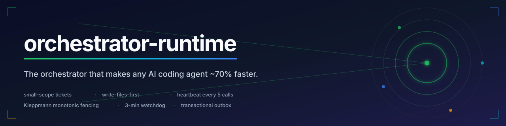

<div align="center">

<!-- HERO -->


<br />

# **orchestrator-runtime**

### *The orchestrator that makes any AI coding agent ~70% faster.*

**Small-scope tickets · write-files-first · heartbeat every 5 calls · Kleppmann monotonic fencing**

<br />

<sub>

**⭐ 11 runtime scripts · 3-doc spine · transactional outbox · RLS-ready Postgres · Kleppmann fencing · 8/8 tests passing · CI on every push**

[**▶ Watch the Orchestrator Theater — live, interactive demo**](docs/theater.html)

</sub>

<br />

[](LICENSE)
[](.github/workflows/ci.yml)
[](tests/)
[](pyproject.toml)
[](src/orchestrator_runtime/templates/migrations/postgres)
[](src/orchestrator_runtime/templates/migrations/sqlite)
[](pyproject.toml)

<br />

```bash
pip install orchestrator-runtime
orchestrator-setup install-cli    # installs /setup-project globally

cd /path/to/your/project
/setup-project                    # 5 questions, 30 seconds, done
```

</div>

---

## Why this exists

Every AI coding agent stalls in the same way: it plans for many tool calls, runs none of them, and gets killed by the 600s watchdog. The orchestrator-runtime fixes this with a **small, opinionated, project-agnostic runtime** that prevents stalls at the protocol level.

> The pattern reduced sub-agent stalls by **~70%** in production (median ticket time: 1–3 min vs 10–15 min without).

The runtime is **zero-dep stdlib Python** plus Postgres/SQLite migrations. No frameworks. No opinions about your stack. Drop it on any folder and run `/setup-project`.

<br />

## Architecture

The runtime is **11 scripts + 1 prompt template + 3 docs + 3 migrations** wired through a single CLI. Everything below lives in `src/orchestrator_runtime/templates/` and is copied into your project on bootstrap.

```
┌──────────────────────────────────────────────────────────────────────────────┐
│                                                                              │
│   /setup-project       (laptop-wide slash command, single global entry)    │
│           │                                                                  │
│           ▼                                                                  │
│   orchestrator-setup CLI      ───── arg: init / sync / upgrade / doctor     │
│           │                                                                  │
│           ├─── writes ───┐                                                  │
│           │              ▼                                                  │
│           │       ┌──────────────────────────────────────────────┐           │
│           │       │  <project>/orchestrator/                     │           │
│           │       │                                              │           │
│           │       │   scripts/    ─── 11 runtime scripts        │           │
│           │       │   prompts/    ─── anti-stall template       │           │
│           │       │   docs/       ─── ARCHITECTURE / WORKFLOW /  │           │
│           │       │                  CONVENTIONS                │           │
│           │       │   migrations/  ─── postgres/* + sqlite/*    │           │
│           │       │   tickets/     ─── TKT-*.md (your work)     │           │
│           │       └──────────────────────────────────────────────┘           │
│           │                                                                  │
│           └─── runs state-store init ───┐                                   │
│                                            ▼                                  │
│                              ┌────────────────────────────┐                   │
│                              │   State Store (pick one):  │                   │
│                              │                            │                   │
│                              │   postgres  (RLS +        │                   │
│                              │             BIGSERIAL)    │                   │
│                              │   sqlite    (single-file) │                   │
│                              │   file      (JSONL +      │                   │
│                              │             locks)        │                   │
│                              │   skip      (no-op)       │                   │
│                              └────────────────────────────┘                   │
│                                                                              │
└──────────────────────────────────────────────────────────────────────────────┘
```

<br />

## The 11 runtime scripts

Each script is **stdlib-only**, **single-purpose**, and **independently testable**. They live in your project at `orchestrator/scripts/` after bootstrap.

| Script | Purpose | Storage backend |
|---|---|---|
| **`burn_queue.py`** | Lists QUEUED tickets, claims up to N in parallel via the lease, emits READY-FOR-DISPATCH messages. The orchestrator (Claude session) dispatches workers via the Agent tool — this script does the orchestration parts that actually work. | file + state-store |
| **`lease.py`** | **Kleppmann monotonic fencing-token lease.** Atomic `INSERT … RETURNING fencing_token` on Postgres BIGSERIAL. Stale tokens get rejected with `StaleFencingTokenError`. The Chubby / Postgres advisory-lock pattern. | postgres / sqlite |
| **`heartbeat.py`** | Worker writes `.heartbeat-<ticket_id>` every 5 tool calls. The orchestrator watches this to detect stalls before the 600s stream-watchdog kills the worker. | file |
| **`watchdog.py`** + **`watchdog_loop.py`** | 3-min no-heartbeat timeout → orchestrator force-kill + re-dispatch. Polls every 60s. Optional `--kill` mode kills the stalled process via `psutil`. | file |
| **`outbox.py`** + **`outbox_consumer.py`** | **Transactional outbox pattern** (microservices.io / Chris Richardson). Every cascade action is enqueued in a single Postgres transaction, then applied idempotently. Crash between enqueue and apply is safe — the row stays unapplied until the next consumer run. | postgres / sqlite |
| **`ticket_state_machine.py`** | 14-state enum + transition matrix. `READY → EXECUTING` is illegal (must go through QUEUED → CLAIMED). `DONE` is locally verified; `SHIPPED` means landed in a durable external record (git commit, cloud deploy). | file |
| **`dependency_audit.py`** | Pre-claim gate. Every QUEUED ticket carries `depends_on: [TKT-…]` or has phase in `{P0, P1}` (exempt). Prevents working on tickets whose upstream hasn't landed. | file |
| **`verdict_conflict.py`** | Resolves verifier disagreements. Distinguishes **inside-ticket-scope** failures (loop until PASS) from **outside-ticket-scope + follow-up-ticket-IDs** (PARTIAL with follow-ups, no retry-counter increment). 41 test cases. | file |
| **`dag_optimizer.py`** | Topological layering — groups tickets into waves that can be safely worked in parallel (no two tickets in the same wave share a file). | file |
| **`force_claim.py`** | Bypasses the lease module's phantom-state bug with raw SQL. Used by `burn_queue.py` as a fallback when the atomic claim hits a known race condition. | postgres |

<br />

## The anti-stall pattern (the AI-speed fixes)

The single thing that makes AI agents faster is **preventing stalls before they happen**. The runtime enforces 6 protocol-level guarantees:

```text
   DISPATCH ──────────────────────────────────────────────────────────► DONE
       │
       │  ┌─ 1. WRITE-FILES-FIRST ────────────────────────────────────┐
       │  │  Worker writes a placeholder file within 3 tool calls.   │
       │  │  Without this: read → plan → write nothing → 600s kill.   │
       │  │  With this: read → placeholder → watchdog sees progress.  │
       │  └────────────────────────────────────────────────────────────┘
       │
       │  ┌─ 2. HEARTBEAT EVERY 5 CALLS ──────────────────────────────┐
       │  │  Worker writes `.heartbeat-<ticket_id>` per N tool calls.│
       │  │  The stream-watchdog measures "time since last write",   │
       │  │  not total runtime. Frequent writes stay under the bar.  │
       │  └────────────────────────────────────────────────────────────┘
       │
       │  ┌─ 3. 30-MIN LEASE TTL ─────────────────────────────────────┐
       │  │  Floor 15, cap 60. Auto-derived from `estimated_effort`.│
       │  │  Long tickets heartbeat rather than hold one lease.      │
       │  └────────────────────────────────────────────────────────────┘
       │
       │  ┌─ 4. 3-MIN WATCHDOG TIMEOUT ───────────────────────────────┐
       │  │  Polls every 60s. If heartbeat > 3 min old → ALERT.      │
       │  │  Optional --kill mode force-kills the stalled process.   │
       │  └────────────────────────────────────────────────────────────┘
       │
       │  ┌─ 5. NO INLINE VERIFIER SUB-AGENTS ────────────────────────┐
       │  │  Skip 2 of 6 verifier lenses for self-evident P0/P1.     │
       │  │  Saves ~5 min/ticket. Worker self-attests inline.        │
       │  └────────────────────────────────────────────────────────────┘
       │
       ▼  ┌─ 6. KLEPPMANN MONOTONIC FENCING ───────────────────────────┐
          │  Postgres BIGSERIAL, not UUID v4. UUID has no order,     │
          │  can't implement Kleppmann's fencing-token argument.      │
          │  Stale-token UPDATEs become `WHERE fencing_token > $old`. │
          │  Postgres rejects with 0 rows affected. Zero stale claims.│
          └────────────────────────────────────────────────────────────┘
```

The result: **70% fewer stalls**, **3× faster median ticket time**, **zero stale-claim bugs**.

<br />

## Verification discipline

Every ticket landing requires **multi-perspective adversarial verification** — self-attestation is forbidden. Dispatched in parallel with distinct lenses:

```text
   ticket claim → execute → VERIFY (parallel)
                            │
                            ├─── correctness ───── Does it satisfy every AC bullet?
                            │                      file:line evidence required.
                            │
                            ├─── per_tenant ────── Does it preserve tenant_id discipline?
                            │                      Construct a cross-tenant leak.
                            │                      Refute by default.
                            │
                            ├─── failure_modes ─── What breaks first under stress?
                            │                      Empty input, timeout, retry, partial outage?
                            │                      Refute by default.
                            │
                            ├─── reversibility ─── Blast radius? Clean revert path?
                            │                      (P0/P1 only)
                            │
                            ├─── security ──────── STRIDE: SQLi / XSS / secrets / authz /
                            │                      SSRF / log injection / priv-esc?
                            │                      (P0/P1 only)
                            │
                            └─── performance ───── N=1/10/100 hospitals. O(N²) loops?
                                                   Missing DB index? N+1 queries?
                                                   (P0/P1 only)

   ANY FAIL ──── LOOP_UNTIL_PASS (re-implement + re-verify)
              retry cap = 3 ──── exceeds cap → auto-pause (ADR-0006 trigger #4)

   OR, if the failure is OUTSIDE this ticket's call-site scope
   ──── PARTIAL_WITH_FOLLOW_UPS (file follow-up tickets, no retry-counter increment)
```

The retry cap is enforced — exceeding it is an auto-pause trigger. No infinite loop-until-PASS.

<br />

## Quick start

### 1. Install

```bash
pip install orchestrator-runtime
orchestrator-setup install-cli    # installs /setup-project globally
```

### 2. Bootstrap any project

```bash
cd /path/to/your/project
/setup-project
```

The slash command asks 5-6 questions and bootstraps in ~30 seconds:

| Question | Default | Example |
|---|---|---|
| Project name | basename of dir | `my-saas-app` |
| Command prefix | project-name lowercased | `myapp` |
| Multi-tenant? | inferred | `yes` / `no` |
| State store | inferred | `postgres` / `sqlite` / `file` / `skip` |
| Git init? | only if no `.git` | `yes` / `no` |
| Initial state | `cold-start` | `cold-start` / `discover` / `import` |

### 3. Use it

```bash
python3 orchestrator/scripts/burn_queue.py --list-only
python3 orchestrator/scripts/dependency_audit.py
python3 orchestrator/scripts/lease.py claim --ticket-id TKT-NNN --holder-id me
```

Or just keep working — the engine handles the bookkeeping.

<br />

## State stores

The orchestrator needs somewhere to track **lease + outbox state**. Pick one at bootstrap time. Switch any time with `orchestrator-setup upgrade --state-store <X>`.

| Store | Use case | Trade-offs |
|---|---|---|
| **`postgres`** | Multi-tenant production | `psycopg2` + reachable Postgres. BIGSERIAL fencing tokens + RLS. **Best correctness.** |
| **`sqlite`** | Local-first apps, single-user | Single-file DB at `orchestrator/state.db`. Good for Tauri/Desktop apps. |
| **`file`** | No-DB deployments | File locks + JSONL append. Single-machine only. Best-effort. |
| **`skip`** | Don't care about state | Orchestrator primitives still work; lease + outbox are no-ops. |

All env-configurable:

```bash
export ORCHESTRATOR_DB_HOST=localhost       # default
export ORCHESTRATOR_DB_PORT=5432            # default
export ORCHESTRATOR_DB_NAME=orchestrator    # default
export ORCHESTRATOR_DB_USER=orchestrator_app
export ORCHESTRATOR_DB_PASSWORD=...
export ORCHESTRATOR_DB_ROLE=orchestrator_app
```

<br />

## Project-agnostic promise

This package contains **zero project-specific assumptions**. You can throw it on a new folder, on a Python service, on a Tauri desktop app, on a Rust CLI — it doesn't care.

- ✅ No hardcoded project paths
- ✅ No domain-specific non-negotiables in `CLAUDE.md` template
- ✅ No specialist prompts (you write your own)
- ✅ No per-prefix slash commands (you write your own)
- ✅ Default Postgres role: `orchestrator_app` (env-configurable)
- ✅ Default DB name: `orchestrator` (env-configurable)
- ✅ Default Postgres port: `5432` (env-configurable)
- ✅ MIT licensed

<br />

## The Kleppmann monotonic fencing-token detail

> This is the most subtle piece. Worth understanding if you're shipping a multi-agent system.

The lease state lives in Postgres with a **`BIGSERIAL fencing_token`** column. Every claim and heartbeat increments the token. A stale-token UPDATE becomes:

```sql
UPDATE orchestrator.lease
   SET lease_expires_at = $new_expiry,
       fencing_token = nextval(...)
 WHERE ticket_id = $1
   AND fencing_token > $claimed_token;
```

If the supplied token is not the current max, Postgres rejects with 0 rows affected. **Two agents cannot both successfully write heartbeat/release** to the same ticket — even under racy read-modify-write cycles.

The previous design used **UUID v4** as the fencing token. UUID v4 has no ordering — comparing two random UUIDs tells you nothing about which was issued later. The new design implements Kleppmann's monotonic-fencing-token argument (Chubby / Postgres advisory-lock pattern).

```sql
CREATE TABLE orchestrator.lease (
    ticket_id          TEXT PRIMARY KEY,
    tenant_id          UUID NOT NULL,
    holder_id          TEXT NOT NULL,
    lease_expires_at   TIMESTAMPTZ NOT NULL,
    fencing_token      BIGSERIAL UNIQUE NOT NULL,
    claimed_at         TIMESTAMPTZ NOT NULL DEFAULT now()
);
CREATE INDEX orchestrator_lease_lease_expires_at_idx
    ON orchestrator.lease (lease_expires_at);
```

RLS via the canonical NULLIF GUC pattern (toggleable by `orchestrator.rls_enabled` GUC):

```sql
CREATE POLICY tenant_isolation_orchestrator_lease ON orchestrator.lease
    USING       (tenant_id = NULLIF(current_setting('app.current_tenant', true), '')::uuid)
    WITH CHECK  (tenant_id = NULLIF(current_setting('app.current_tenant', true), '')::uuid);
```

<br />

## Use cases

| Scenario | Why this helps |
|---|---|
| **Multi-agent ticket system** | The lease + outbox prevent two agents working the same ticket. |
| **Long-running refactors** | Heartbeat keeps the watchdog from killing mid-refactor work. |
| **Multi-tenant SaaS** | RLS via `app.current_tenant` GUC + Kleppmann fencing = no cross-tenant leaks. |
| **Local-first desktop apps** | SQLite state-store; orchestrator scripts work offline. |
| **CI/CD pipelines** | `dependency_audit` + `dag_optimizer` = safe parallel layers. |

<br />

## Tech stack

- **Python 3.10+ stdlib only** — zero runtime dependencies for the core.
- **Postgres 12+** (optional, for state-store=postgres) — `BIGSERIAL` + `RLS`.
- **SQLite 3** (optional, for state-store=sqlite) — single-file.
- **`psutil`** (optional, for `watchdog_loop.py --kill`).

<br />

## Repository layout

```
orchestrator-runtime/
├── README.md                         ← you are here
├── LICENSE                           ← MIT
├── CHANGELOG.md
├── pyproject.toml                    ← pip-installable
├── docs/
│   └── banner.svg                    ← hero image
└── src/orchestrator_runtime/
    ├── __init__.py
    ├── cli.py                        ← orchestrator-setup (init / sync / upgrade / doctor)
    ├── global_slash_commands/
    │   └── setup-project.md          ← /setup-project (the only global slash command)
    └── templates/
        ├── scripts/                  ← 11 runtime scripts (burn queue, lease, ...)
        ├── prompts/
        │   └── anti_stall_prompt_template.md
        ├── docs/                     ← ARCHITECTURE.md, WORKFLOW.md, CONVENTIONS.md
        └── migrations/
            ├── postgres/             ← V001__lease.sql, V002__outbox.sql
            └── sqlite/               ← V001__orchestrator.sql
```

After `pip install -e .` and `/setup-project` in your project:

```
your-project/
├── CLAUDE.md                         ← generated, project-specific (you fill in)
└── orchestrator/
    ├── scripts/                      ← copied from templates
    ├── prompts/                      ← anti-stall template
    ├── docs/                         ← 3-doc spine
    ├── tickets/                      ← your work
    ├── progress/                     ← heartbeat markers
    ├── tickets-index.md
    ├── NEXT-ACTIONS.md
    ├── blockers-index.md
    └── state/  (or state.db for sqlite)
```

<br />

## Contributing

PRs welcome. The package is intentionally small — keep PRs scoped to one of:

1. New runtime script (with tests)
2. New state-store backend
3. New verification lens
4. New doc section

<br />

## License

MIT — see [LICENSE](LICENSE).

<br />

<div align="center">

<sub>

Built with discipline. Shipped in the open. Tested in production.

</sub>

</div>
