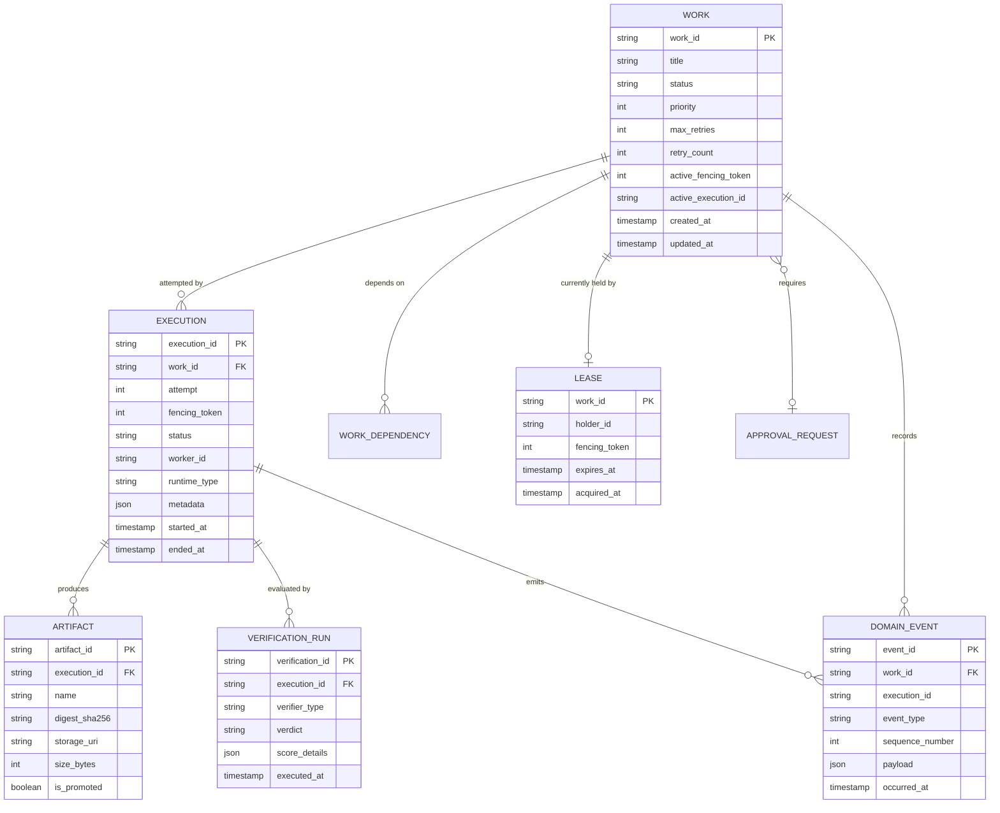

# Domain Model: Entity Relationships & Specifications

## 1. Domain Entity Relationship Diagram



---

## 2. Formal Entity Specifications

### 2.1 Work Entity
```python
@dataclass(frozen=True)
class Work:
    work_id: str
    title: str
    description: str
    status: WorkStatus
    priority: int = 0
    max_retries: int = 3
    retry_count: int = 0
    timeout_seconds: int = 3600
    heartbeat_timeout_seconds: int = 180
    dependencies: tuple[str, ...] = ()
    labels: tuple[str, ...] = ()
    inputs: dict[str, Any] = field(default_factory=dict)
    active_fencing_token: Optional[int] = None
    active_execution_id: Optional[str] = None
    created_at: datetime = field(default_factory=datetime.utcnow)
    updated_at: datetime = field(default_factory=datetime.utcnow)
```

### 2.2 Execution Entity
```python
@dataclass(frozen=True)
class Execution:
    execution_id: str
    work_id: str
    attempt: int
    fencing_token: int
    status: ExecutionStatus
    worker_id: str
    runtime_type: str
    workspace_path: Optional[str] = None
    exit_code: Optional[int] = None
    error_message: Optional[str] = None
    started_at: datetime = field(default_factory=datetime.utcnow)
    ended_at: Optional[datetime] = None
```

### 2.3 Lease Entity
```python
@dataclass(frozen=True)
class Lease:
    work_id: str
    holder_id: str
    fencing_token: int
    expires_at: datetime
    acquired_at: datetime = field(default_factory=datetime.utcnow)

    def is_expired(self, current_time: datetime) -> bool:
        return current_time >= self.expires_at
```

### 2.4 Artifact Entity
```python
@dataclass(frozen=True)
class Artifact:
    artifact_id: str
    execution_id: str
    name: str
    digest_sha256: str
    storage_uri: str
    size_bytes: int
    mime_type: str = "application/octet-stream"
    is_promoted: bool = False
    created_at: datetime = field(default_factory=datetime.utcnow)
```

### 2.5 Verification Entity
```python
@dataclass(frozen=True)
class VerificationResult:
    verification_id: str
    execution_id: str
    verifier_name: str
    passed: bool
    verdict_summary: str
    details: dict[str, Any] = field(default_factory=dict)
    executed_at: datetime = field(default_factory=datetime.utcnow)
```
