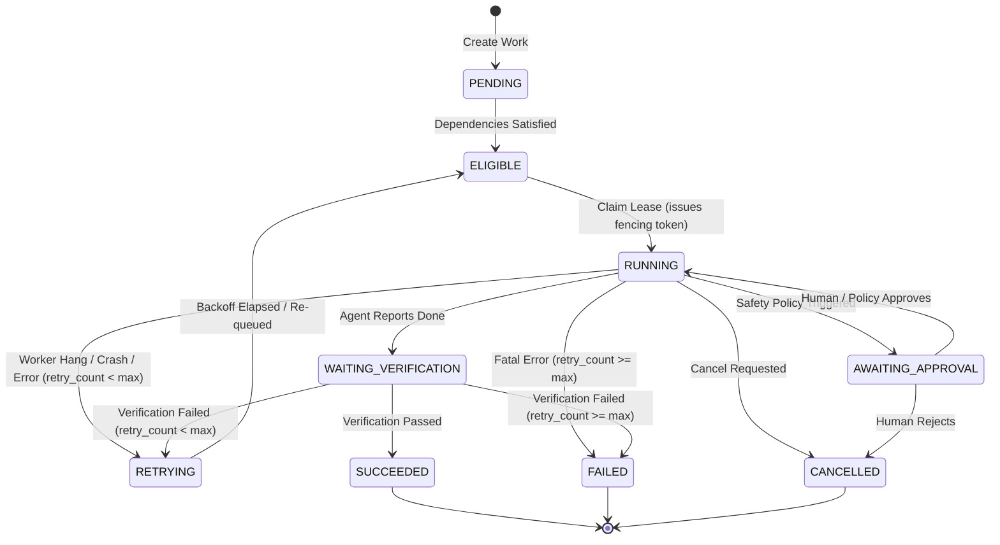

# State Machine Specification: Work & Execution Lifecycles

## 1. Work State Transition Diagram

---

## 2. Formal Transition Matrix

| From State | To State | Trigger / Event | Authorized Actor | Pre-Conditions & Evidence Required |
| :--- | :--- | :--- | :--- | :--- |
| `PENDING` | `ELIGIBLE` | `EVALUATE_DEPENDENCIES` | Control Plane Scheduler | All upstream `work_id` in dependencies are `SUCCEEDED`. |
| `ELIGIBLE` | `RUNNING` | `CLAIM_LEASE` | Worker / Runtime | Atomic DB claim; increments `fencing_token`; sets `lease_expires_at`. |
| `RUNNING` | `WAITING_VERIFICATION` | `SUBMIT_FOR_VERIFICATION` | Worker Agent | Valid active fencing token; candidate artifacts declared. |
| `RUNNING` | `AWAITING_APPROVAL` | `REQUEST_APPROVAL` | Policy Engine / Worker | Action triggers approval rule (e.g. schema migration, secret access). |
| `AWAITING_APPROVAL` | `RUNNING` | `APPROVE` | Human Operator | Explicit cryptographic or authenticated human decision token. |
| `AWAITING_APPROVAL` | `CANCELLED` | `REJECT` | Human Operator | Rejection rationale provided. |
| `WAITING_VERIFICATION` | `SUCCEEDED` | `VERIFICATION_PASSED` | Independent Verifier | All deterministic test suites and checks returned `passed=True`. |
| `WAITING_VERIFICATION` | `RETRYING` | `VERIFICATION_FAILED` | Independent Verifier | Test failure logs attached; `retry_count < max_retries`. |
| `WAITING_VERIFICATION` | `FAILED` | `VERIFICATION_FAILED` | Independent Verifier | `retry_count >= max_retries`. |
| `RUNNING` | `RETRYING` | `LEASE_EXPIRED` / `CRASH` | Reconciliation Watchdog| Lease expired on DB clock; `retry_count < max_retries`. |
| `RUNNING` | `FAILED` | `LEASE_EXPIRED` / `CRASH` | Reconciliation Watchdog| Lease expired on DB clock; `retry_count >= max_retries`. |
| `ANY_NON_TERMINAL` | `CANCELLED` | `CANCEL_WORK` | Human / Supervisor | Explicit cancellation reason recorded; worker killed. |

---

## 3. Strict Concurrency & Authorization Rules

1. **Terminal State Immutability:** Once a Work enters `SUCCEEDED`, `FAILED`, or `CANCELLED`, no further transitions are legally permissible.
2. **Actor Authorization:** An agent (`ActorRole.AGENT_WORKER`) can **only** trigger `SUBMIT_FOR_VERIFICATION` or `REQUEST_APPROVAL`. An agent can **never** self-transition to `SUCCEEDED` or `APPROVED`.
3. **Optimistic Version Check:** Every transition executes:
   $$\text{UPDATE work SET status = :new, version = version + 1 WHERE id = :id AND version = :expected}$$
   If another transaction mutated the record, the update affects 0 rows and aborts.
